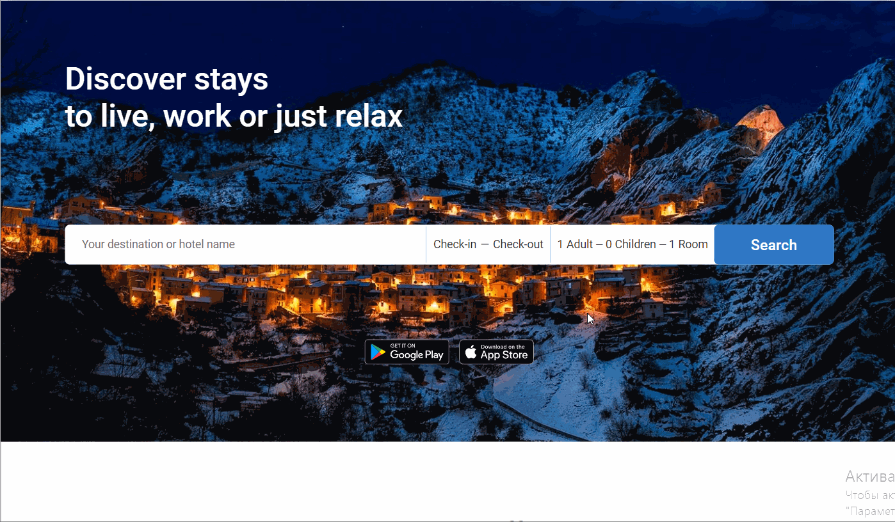
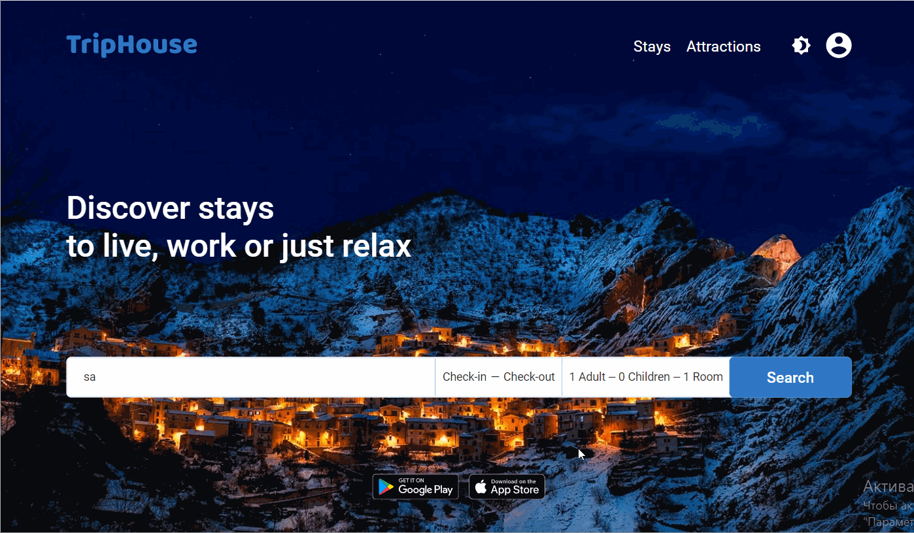
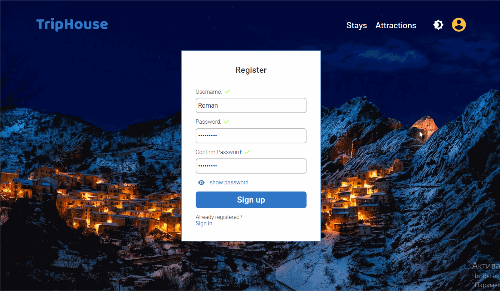

# TripHouse (Booking Hotels)
The Trip House is a platform where user can choose and book an apartment or hotel suitable for his criteria.
## Design

Project development based on the [design template](https://www.figma.com/file/IXx7153gRKSHFYwXs4Sc5t/TripHouse).

## Interesting technical solutions
#### Implementing calendar logic without using third-party libraries

#### Animated section of the loading process during a user request

#### Option to select a color theme

## Technologies
* HTML5
* CSS3, Styled Components
* JavaScript
* React, React Hooks, React Router
* Redux, Redux Saga, Redux Actions
* Rest API
* Eslint + prettier
